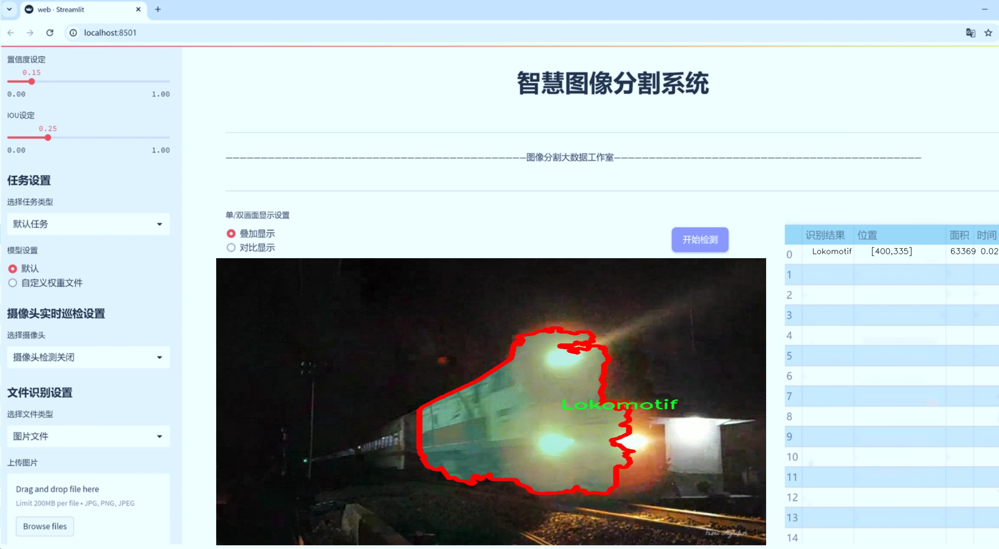
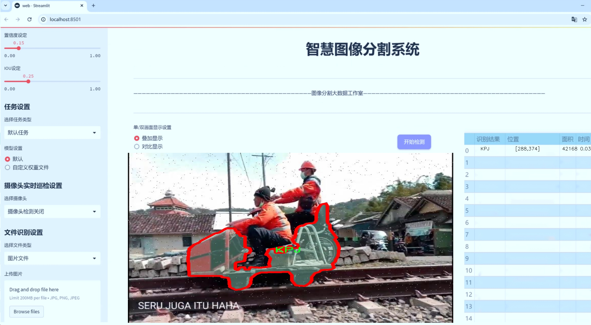
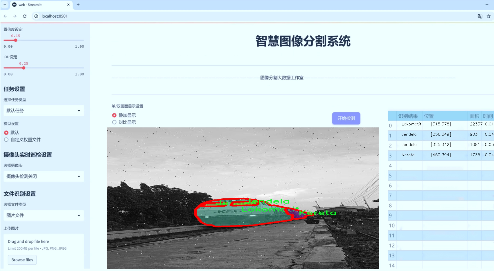
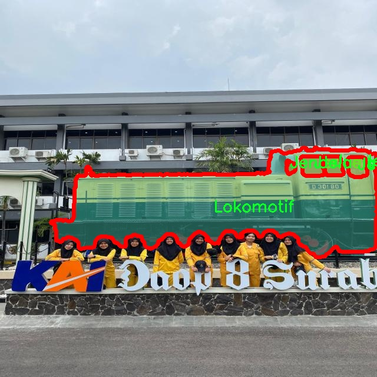
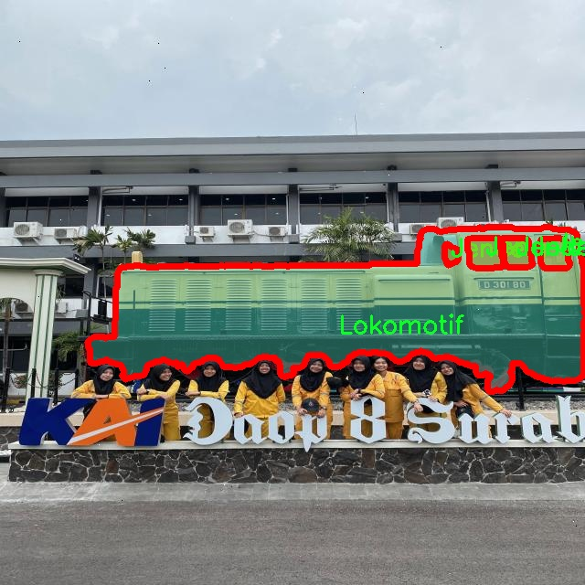
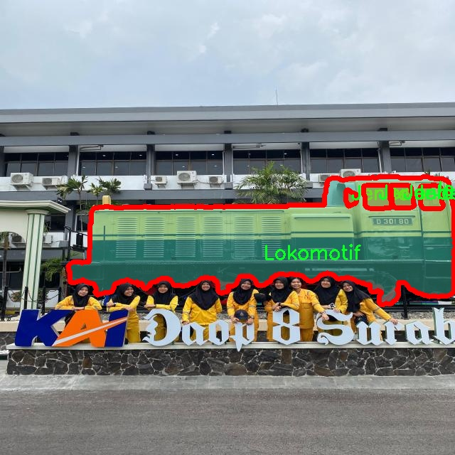
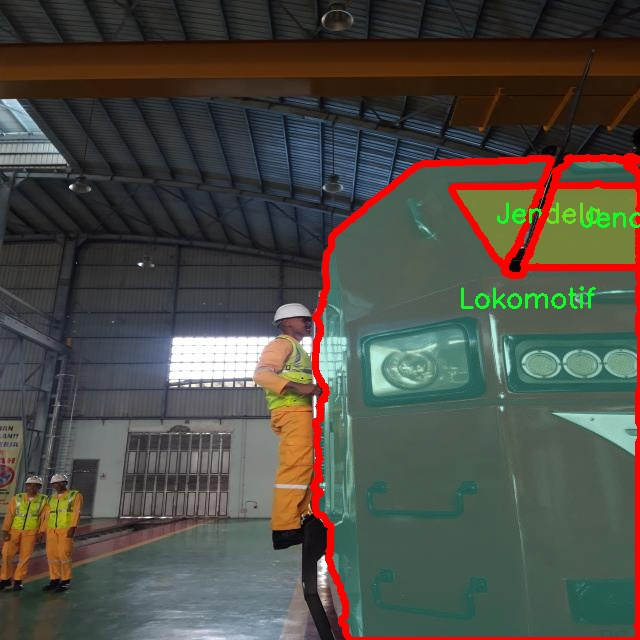
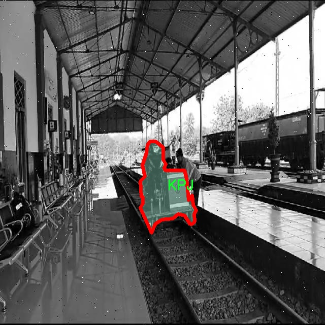

# 交通工具图像分割系统源码＆数据集分享
 [yolov8-seg-bifpn＆yolov8-seg-C2f-FocusedLinearAttention等50+全套改进创新点发刊_一键训练教程_Web前端展示]

### 1.研究背景与意义

项目参考[ILSVRC ImageNet Large Scale Visual Recognition Challenge](https://gitee.com/YOLOv8_YOLOv11_Segmentation_Studio/projects)

项目来源[AAAI Global Al lnnovation Contest](https://kdocs.cn/l/cszuIiCKVNis)

研究背景与意义

随着城市化进程的加快，交通工具的种类和数量日益增加，交通管理和安全问题愈发突出。传统的交通监控手段往往依赖人工巡查和简单的图像处理技术，难以满足实时性和准确性的要求。因此，基于计算机视觉的自动化交通工具识别与分割技术应运而生，成为提升交通管理效率的重要手段。近年来，深度学习技术的迅猛发展，尤其是目标检测和图像分割领域的突破，为交通工具的智能识别提供了新的可能性。

YOLO（You Only Look Once）系列模型作为一种高效的目标检测算法，因其实时性和高准确率而广泛应用于各类视觉任务。YOLOv8作为该系列的最新版本，结合了多种先进的深度学习技术，具备了更强的特征提取能力和更高的检测精度。然而，尽管YOLOv8在目标检测方面表现出色，但在交通工具的图像分割任务中仍存在一定的局限性。特别是在复杂背景下，交通工具的边界模糊、遮挡现象频繁，导致分割效果不理想。因此，针对YOLOv8进行改进，以提升其在交通工具图像分割中的表现，具有重要的研究意义。

本研究将基于改进YOLOv8的框架，构建一个高效的交通工具图像分割系统。所使用的数据集包含1300张图像，涵盖了四类交通工具：Jendela（窗户）、KPJ（车厢）、Kereta（火车）和Lokomotif（机车）。这一数据集的多样性和丰富性为模型的训练和评估提供了良好的基础。通过对这些图像进行实例分割，不仅可以精确识别每种交通工具的轮廓，还能有效处理交通工具之间的重叠和遮挡问题，从而实现更为细致的交通监控。

改进YOLOv8的交通工具图像分割系统，不仅能够提高交通工具的识别精度，还能为智能交通系统的建设提供有力支持。通过实时监控和分析交通流量，交通管理部门可以更好地调配资源，优化交通信号控制，减少交通拥堵，提高道路安全性。此外，该系统还可以为自动驾驶技术的发展提供重要的数据支持，推动智能交通的全面进步。

综上所述，基于改进YOLOv8的交通工具图像分割系统的研究，不仅具有重要的理论价值，也具有广泛的应用前景。通过深入探讨该系统的设计与实现，将为未来的交通管理与智能监控提供新的思路和方法，推动交通领域的技术创新与发展。

### 2.图片演示







##### 注意：由于此博客编辑较早，上面“2.图片演示”和“3.视频演示”展示的系统图片或者视频可能为老版本，新版本在老版本的基础上升级如下：（实际效果以升级的新版本为准）

  （1）适配了YOLOV8的“目标检测”模型和“实例分割”模型，通过加载相应的权重（.pt）文件即可自适应加载模型。

  （2）支持“图片识别”、“视频识别”、“摄像头实时识别”三种识别模式。

  （3）支持“图片识别”、“视频识别”、“摄像头实时识别”三种识别结果保存导出，解决手动导出（容易卡顿出现爆内存）存在的问题，识别完自动保存结果并导出到tempDir中。

  （4）支持Web前端系统中的标题、背景图等自定义修改，后面提供修改教程。

  另外本项目提供训练的数据集和训练教程,暂不提供权重文件（best.pt）,需要您按照教程进行训练后实现图片演示和Web前端界面演示的效果。

### 3.视频演示

[3.1 视频演示](https://www.bilibili.com/video/BV1h3yEYWE9S/)

### 4.数据集信息展示

##### 4.1 本项目数据集详细数据（类别数＆类别名）

nc: 4
names: ['Jendela', 'KPJ', 'Kereta', 'Lokomotif']


##### 4.2 本项目数据集信息介绍

数据集信息展示

在现代计算机视觉领域，图像分割技术在交通工具识别与分析中扮演着至关重要的角色。为了有效地训练和改进YOLOv8-seg模型，我们采用了名为“segmen”的数据集。该数据集专门针对交通工具的图像分割任务，旨在提高模型在实际应用中的准确性和鲁棒性。

“segmen”数据集包含四个主要类别，分别是“Jendela”（窗户）、“KPJ”（交通工具的某种特定部件）、“Kereta”（火车）和“Lokomotif”（机车）。这些类别的选择不仅反映了交通工具的多样性，也为模型提供了丰富的训练样本，使其能够更好地理解和分辨不同类型的交通工具及其组成部分。

在数据集的构建过程中，确保每个类别的样本数量和质量至关重要。为了实现这一目标，数据集的创建者从多个来源收集了大量的交通工具图像，并对其进行了精细的标注。这些图像涵盖了不同的拍摄角度、光照条件和背景环境，旨在模拟真实世界中可能遇到的各种情况。这种多样性不仅增强了数据集的代表性，也为模型的泛化能力提供了保障。

在标注过程中，采用了先进的图像分割技术，对每个类别的对象进行了精确的像素级标注。这种细致的标注方式使得模型在训练时能够学习到更为细微的特征，从而在进行图像分割时能够实现更高的准确性。例如，在“Kereta”类别中，模型不仅需要识别火车的整体轮廓，还需要能够区分车厢、车轮等细节部分；而在“Jendela”类别中，模型则需要准确地识别出窗户的边缘和形状。

此外，数据集的规模也是影响模型训练效果的重要因素。为了确保“segmen”数据集的有效性，开发团队进行了大量的数据增强操作，包括旋转、缩放、翻转等。这些操作不仅增加了数据集的样本数量，还提高了模型对不同变换的适应能力，使其在面对实际应用中的各种变化时，能够保持良好的性能。

在训练过程中，YOLOv8-seg模型将利用“segmen”数据集中的图像及其对应的标注信息，通过深度学习算法不断优化其参数，以提高对交通工具的分割精度。通过多轮迭代训练，模型将逐渐掌握如何在复杂背景中准确识别和分割出各类交通工具，最终实现高效、准确的图像分割。

总之，“segmen”数据集不仅为YOLOv8-seg模型的训练提供了丰富的样本和精确的标注，还通过多样化的图像和增强技术，确保了模型在实际应用中的表现。随着数据集的不断完善和模型的持续优化，我们期待在交通工具图像分割领域取得更为显著的进展，为智能交通系统的发展贡献力量。











### 5.全套项目环境部署视频教程（零基础手把手教学）

[5.1 环境部署教程链接（零基础手把手教学）](https://www.bilibili.com/video/BV1jG4Ve4E9t/?vd_source=bc9aec86d164b67a7004b996143742dc)


[5.2 安装Python虚拟环境创建和依赖库安装视频教程链接（零基础手把手教学）](https://www.bilibili.com/video/BV1nA4VeYEze/?vd_source=bc9aec86d164b67a7004b996143742dc)

### 6.手把手YOLOV8-seg训练视频教程（零基础小白有手就能学会）

[6.1 手把手YOLOV8-seg训练视频教程（零基础小白有手就能学会）](https://www.bilibili.com/video/BV1cA4VeYETe/?vd_source=bc9aec86d164b67a7004b996143742dc)


按照上面的训练视频教程链接加载项目提供的数据集，运行train.py即可开始训练



     Epoch   gpu_mem       box       obj       cls    labels  img_size
     1/200     0G   0.01576   0.01955  0.007536        22      1280: 100%|██████████| 849/849 [14:42<00:00,  1.04s/it]
               Class     Images     Labels          P          R     mAP@.5 mAP@.5:.95: 100%|██████████| 213/213 [01:14<00:00,  2.87it/s]
                 all       3395      17314      0.994      0.957      0.0957      0.0843

     Epoch   gpu_mem       box       obj       cls    labels  img_size
     2/200     0G   0.01578   0.01923  0.007006        22      1280: 100%|██████████| 849/849 [14:44<00:00,  1.04s/it]
               Class     Images     Labels          P          R     mAP@.5 mAP@.5:.95: 100%|██████████| 213/213 [01:12<00:00,  2.95it/s]
                 all       3395      17314      0.996      0.956      0.0957      0.0845

     Epoch   gpu_mem       box       obj       cls    labels  img_size
     3/200     0G   0.01561    0.0191  0.006895        27      1280: 100%|██████████| 849/849 [10:56<00:00,  1.29it/s]
               Class     Images     Labels          P          R     mAP@.5 mAP@.5:.95: 100%|███████   | 187/213 [00:52<00:00,  4.04it/s]
                 all       3395      17314      0.996      0.957      0.0957      0.0845


### 7.50+种全套YOLOV8-seg创新点代码加载调参视频教程（一键加载写好的改进模型的配置文件）

[7.1 50+种全套YOLOV8-seg创新点代码加载调参视频教程（一键加载写好的改进模型的配置文件）](https://www.bilibili.com/video/BV1Hw4VePEXv/?vd_source=bc9aec86d164b67a7004b996143742dc)

### 8.YOLOV8-seg图像分割算法原理

原始YOLOv8-seg算法原理

YOLOv8-seg算法是YOLO系列目标检测模型的最新进展，旨在提升目标检测的准确性和效率，尤其是在分割任务中的表现。作为YOLOv8的扩展版本，YOLOv8-seg不仅继承了前几代模型的优点，还引入了一系列创新的设计理念和技术，使其在处理复杂场景时具备更强的能力。

YOLOv8-seg的核心架构仍然基于其前身YOLOv8，主要由三个部分构成：Backbone、Neck和Head。Backbone负责特征提取，Neck用于特征融合，而Head则进行最终的目标检测和分割。特征提取部分采用了CSPDarknet结构，这种结构通过跨阶段的部分连接设计，能够有效地捕捉到图像中的多层次特征。CSPDarknet将输入特征图分为两个分支，每个分支经过卷积层处理，进一步增强了特征的表达能力。

在YOLOv8-seg中，C2f模块的引入是一个重要的改进。C2f模块通过将特征图分成多个分支，增加了网络的深度和宽度，使得梯度流动更加顺畅，从而提升了模型的学习能力。与YOLOv5中的C3模块相比，C2f模块的设计更加轻量化，能够在保证性能的同时减少计算资源的消耗。此外，YOLOv8-seg还采用了快速空间金字塔池化（SPPF）结构，以提取不同尺度的特征，进一步提升了模型对多尺度目标的适应能力。

在目标检测部分，YOLOv8-seg继续使用特征金字塔网络（FPN）和路径聚合网络（PAN）的组合结构。FPN能够有效地融合来自不同层次的特征信息，而PAN则通过引入额外的路径来增强特征的传递和融合。这种设计使得YOLOv8-seg在处理复杂场景时，能够更好地捕捉到目标的上下文信息，从而提高检测的准确性。

YOLOv8-seg的检测头采用了解耦结构，这意味着分类和定位任务被分开处理。通过两个并行的分支，模型能够分别提取类别特征和位置特征，从而在进行分类和定位时，能够更专注于各自的任务。这种解耦设计不仅提高了模型的灵活性，还增强了其在复杂场景下的表现。

在损失函数的设计上，YOLOv8-seg引入了变焦损失（Varifocal Loss）和CIoU损失等新策略。变焦损失通过对正负样本进行不对称加权，使得模型在训练时更加关注高质量的正样本，从而提高了检测的精度。CIoU损失则通过考虑预测框与真实框之间的重叠度、中心点距离和长宽比，综合评估模型的定位性能。这种多维度的损失设计，使得YOLOv8-seg在训练过程中能够更好地优化模型参数，提升检测效果。

此外，YOLOv8-seg在标签分配策略上也进行了创新。与YOLOv5的自动聚类候选框策略不同，YOLOv8-seg采用了动态标签分配策略。这种策略通过实时分析样本的特征，动态调整正负样本的匹配方式，从而提高了样本利用率和模型的学习效率。YOLOv8-seg的标签分配不仅考虑了目标的尺寸和比例，还结合了目标的上下文信息，使得模型在复杂场景下的表现更加稳健。

YOLOv8-seg的设计目标是实现高效的目标检测与分割任务。通过优化的特征提取网络、灵活的特征融合结构和创新的损失函数设计，YOLOv8-seg在准确性和速度上都取得了显著的提升。尤其是在处理复杂背景和多目标场景时，YOLOv8-seg展现出了卓越的性能，能够有效地分割出不同类别的目标，为后续的图像分析和理解提供了可靠的基础。

总之，YOLOv8-seg算法在YOLO系列的基础上，结合了多项前沿技术和设计理念，形成了一种高效、准确的目标检测与分割解决方案。其在特征提取、特征融合、损失函数和标签分配等多个方面的创新，使得YOLOv8-seg在实际应用中展现出了极大的潜力，尤其是在需要实时处理和高精度检测的场景中，具有广泛的应用前景。随着深度学习技术的不断发展，YOLOv8-seg无疑将成为目标检测领域的重要工具，推动相关研究和应用的进一步发展。


### 9.系统功能展示（检测对象为举例，实际内容以本项目数据集为准）

图9.1.系统支持检测结果表格显示

  图9.2.系统支持置信度和IOU阈值手动调节

  图9.3.系统支持自定义加载权重文件best.pt(需要你通过步骤5中训练获得)

  图9.4.系统支持摄像头实时识别

  图9.5.系统支持图片识别

  图9.6.系统支持视频识别

  图9.7.系统支持识别结果文件自动保存

  图9.8.系统支持Excel导出检测结果数据


### 10.50+种全套YOLOV8-seg创新点原理讲解（非科班也可以轻松写刊发刊，V11版本正在科研待更新）

#### 10.1 由于篇幅限制，每个创新点的具体原理讲解就不一一展开，具体见下列网址中的创新点对应子项目的技术原理博客网址【Blog】：


[10.1 50+种全套YOLOV8-seg创新点原理讲解链接](https://gitee.com/qunmasj/good)

#### 10.2 部分改进模块原理讲解(完整的改进原理见上图和技术博客链接)【如果此小节的图加载失败可以通过CSDN或者Github搜索该博客的标题访问原始博客，原始博客图片显示正常】
### CBAM空间注意力机制
近年来，随着深度学习研究方向的火热，注意力机制也被广泛地应用在图像识别、语音识别和自然语言处理等领域，注意力机制在深度学习任务中发挥着举足轻重的作用。注意力机制借鉴于人类的视觉系统，例如，人眼在看到一幅画面时，会倾向于关注画面中的重要信息，而忽略其他可见的信息。深度学习中的注意力机制和人类视觉的注意力机制相似，通过扫描全局数据，从大量数据中选择出需要重点关注的、对当前任务更为重要的信息，然后对这部分信息分配更多的注意力资源，从这些信息中获取更多所需要的细节信息，而抑制其他无用的信息。而在深度学习中，则具体表现为给感兴趣的区域更高的权重，经过网络的学习和调整，得到最优的权重分配，形成网络模型的注意力，使网络拥有更强的学习能力，加快网络的收敛速度。
注意力机制通常可分为软注意力机制和硬注意力机制[4-5]。软注意力机制在选择信息时，不是从输入的信息中只选择1个，而会用到所有输入信息，只是各个信息对应的权重分配不同，然后输入网络模型进行计算;硬注意力机制则是从输入的信息中随机选取一个或者选择概率最高的信息，但是这一步骤通常是不可微的，导致硬注意力机制更难训练。因此，软注意力机制应用更为广泛，按照原理可将软注意力机制划分为:通道注意力机制（channel attention)、空间注意力机制(spatial attention）和混合域注意力机制(mixed attention)。
通道注意力机制的本质建立各个特征通道之间的重要程度，对感兴趣的通道进行重点关注，弱化不感兴趣的通道的作用;空间注意力的本质则是建模了整个空间信息的重要程度，然后对空间内感兴趣的区域进行重点关注，弱化其余非感兴趣区域的作用;混合注意力同时运用了通道注意力和空间注意力，两部分先后进行或并行，形成对通道特征和空间特征同时关注的注意力模型。

卷积层注意力模块(Convolutional Block Attention Module，CBAM）是比较常用的混合注意力模块，其先后集中了通道注意力模块和空间注意力模块，网络中加入该模块能有效提高网络性能，减少网络模型的计算量，模块结构如图所示。输入特征图首先经过分支的通道注意力模块，然后和主干的原特征图融合，得到具有通道注意力的特征图，接着经过分支的空间注意力模块，在和主干的特征图融合后，得到同时具有通道特征注意力和空间特征注意力的特征图。CBAM模块不改变输入特征图的大小，因此该模块是一个“即插即用”的模块，可以插入网络的任何位置。

通道注意力模块的结构示意图如图所示，通道注意力模块分支并行地对输入的特征图进行最大池化操作和平均池化操作，然后利用多层感知机对结果进行变换，得到应用于两个通道的变换结果，最后经过sigmoid激活函数将变换结果融合，得到具有通道注意力的通道特征图。

空间注意力模块示意图如图所示，将通道注意力模块输出的特征图作为该模块的输入特征图，首先对输入特征图进行基于通道的最大池化操作和平均池化操作，将两部分得到的结果拼接起来，然后通过卷积得到降为Ⅰ通道的特征图，最后通过sigmoid激活函数生成具有空间注意力的特征图。


### 11.项目核心源码讲解（再也不用担心看不懂代码逻辑）

#### 11.1 ultralytics\models\sam\modules\transformer.py

以下是对代码中最核心部分的保留和详细中文注释：

```python
import math
from typing import Tuple, Type
import torch
from torch import Tensor, nn
from ultralytics.nn.modules import MLPBlock

class TwoWayTransformer(nn.Module):
    """
    双向变换器模块，能够同时关注图像和查询点。该类作为一个专门的变换器解码器，
    使用提供的查询位置嵌入来关注输入图像。这在目标检测、图像分割和点云处理等任务中尤其有用。
    """

    def __init__(self, depth: int, embedding_dim: int, num_heads: int, mlp_dim: int, activation: Type[nn.Module] = nn.ReLU, attention_downsample_rate: int = 2) -> None:
        """
        初始化双向变换器。

        Args:
          depth (int): 变换器的层数
          embedding_dim (int): 输入嵌入的通道维度
          num_heads (int): 多头注意力的头数，必须能整除embedding_dim
          mlp_dim (int): MLP块内部的通道维度
        """
        super().__init__()
        self.depth = depth
        self.embedding_dim = embedding_dim
        self.num_heads = num_heads
        self.mlp_dim = mlp_dim
        self.layers = nn.ModuleList()

        # 添加多个双向注意力块
        for i in range(depth):
            self.layers.append(
                TwoWayAttentionBlock(
                    embedding_dim=embedding_dim,
                    num_heads=num_heads,
                    mlp_dim=mlp_dim,
                    activation=activation,
                    attention_downsample_rate=attention_downsample_rate,
                    skip_first_layer_pe=(i == 0),
                ))

        # 最终的注意力层和归一化层
        self.final_attn_token_to_image = Attention(embedding_dim, num_heads, downsample_rate=attention_downsample_rate)
        self.norm_final_attn = nn.LayerNorm(embedding_dim)

    def forward(self, image_embedding: Tensor, image_pe: Tensor, point_embedding: Tensor) -> Tuple[Tensor, Tensor]:
        """
        前向传播函数。

        Args:
          image_embedding (torch.Tensor): 要关注的图像，形状为 B x embedding_dim x h x w。
          image_pe (torch.Tensor): 添加到图像的位置信息，形状与image_embedding相同。
          point_embedding (torch.Tensor): 添加到查询点的嵌入，形状为 B x N_points x embedding_dim。

        Returns:
          (torch.Tensor): 处理后的point_embedding
          (torch.Tensor): 处理后的image_embedding
        """
        # 将图像嵌入展平并转置
        bs, c, h, w = image_embedding.shape
        image_embedding = image_embedding.flatten(2).permute(0, 2, 1)
        image_pe = image_pe.flatten(2).permute(0, 2, 1)

        # 准备查询和键
        queries = point_embedding
        keys = image_embedding

        # 应用变换器块
        for layer in self.layers:
            queries, keys = layer(queries=queries, keys=keys, query_pe=point_embedding, key_pe=image_pe)

        # 应用最终的注意力层
        q = queries + point_embedding
        k = keys + image_pe
        attn_out = self.final_attn_token_to_image(q=q, k=k, v=keys)
        queries = queries + attn_out
        queries = self.norm_final_attn(queries)

        return queries, keys


class TwoWayAttentionBlock(nn.Module):
    """
    一个注意力块，执行自注意力和交叉注意力，支持双向查询和键的注意力。
    包含四个主要层：自注意力、查询到键的交叉注意力、MLP块、键到查询的交叉注意力。
    """

    def __init__(self, embedding_dim: int, num_heads: int, mlp_dim: int = 2048, activation: Type[nn.Module] = nn.ReLU, attention_downsample_rate: int = 2, skip_first_layer_pe: bool = False) -> None:
        """
        初始化双向注意力块。

        Args:
          embedding_dim (int): 嵌入的通道维度
          num_heads (int): 注意力层的头数
          mlp_dim (int): MLP块的隐藏维度
          activation (nn.Module): MLP块的激活函数
          skip_first_layer_pe (bool): 是否在第一层跳过位置编码
        """
        super().__init__()
        self.self_attn = Attention(embedding_dim, num_heads)
        self.norm1 = nn.LayerNorm(embedding_dim)

        self.cross_attn_token_to_image = Attention(embedding_dim, num_heads, downsample_rate=attention_downsample_rate)
        self.norm2 = nn.LayerNorm(embedding_dim)

        self.mlp = MLPBlock(embedding_dim, mlp_dim, activation)
        self.norm3 = nn.LayerNorm(embedding_dim)

        self.norm4 = nn.LayerNorm(embedding_dim)
        self.cross_attn_image_to_token = Attention(embedding_dim, num_heads, downsample_rate=attention_downsample_rate)

        self.skip_first_layer_pe = skip_first_layer_pe

    def forward(self, queries: Tensor, keys: Tensor, query_pe: Tensor, key_pe: Tensor) -> Tuple[Tensor, Tensor]:
        """应用自注意力和交叉注意力，返回处理后的嵌入。"""

        # 自注意力块
        if self.skip_first_layer_pe:
            queries = self.self_attn(q=queries, k=queries, v=queries)
        else:
            q = queries + query_pe
            attn_out = self.self_attn(q=q, k=q, v=queries)
            queries = queries + attn_out
        queries = self.norm1(queries)

        # 交叉注意力块，查询关注图像嵌入
        q = queries + query_pe
        k = keys + key_pe
        attn_out = self.cross_attn_token_to_image(q=q, k=k, v=keys)
        queries = queries + attn_out
        queries = self.norm2(queries)

        # MLP块
        mlp_out = self.mlp(queries)
        queries = queries + mlp_out
        queries = self.norm3(queries)

        # 交叉注意力块，图像嵌入关注查询
        q = queries + query_pe
        k = keys + key_pe
        attn_out = self.cross_attn_image_to_token(q=k, k=q, v=queries)
        keys = keys + attn_out
        keys = self.norm4(keys)

        return queries, keys


class Attention(nn.Module):
    """一个注意力层，允许在投影到查询、键和值后对嵌入的大小进行下采样。"""

    def __init__(self, embedding_dim: int, num_heads: int, downsample_rate: int = 1) -> None:
        """
        初始化注意力模型。

        Args:
            embedding_dim (int): 输入嵌入的维度。
            num_heads (int): 注意力头的数量。
            downsample_rate (int, optional): 内部维度的下采样因子，默认为1。
        """
        super().__init__()
        self.embedding_dim = embedding_dim
        self.internal_dim = embedding_dim // downsample_rate
        self.num_heads = num_heads
        assert self.internal_dim % num_heads == 0, 'num_heads必须能整除embedding_dim。'

        # 定义线性投影层
        self.q_proj = nn.Linear(embedding_dim, self.internal_dim)
        self.k_proj = nn.Linear(embedding_dim, self.internal_dim)
        self.v_proj = nn.Linear(embedding_dim, self.internal_dim)
        self.out_proj = nn.Linear(self.internal_dim, embedding_dim)

    @staticmethod
    def _separate_heads(x: Tensor, num_heads: int) -> Tensor:
        """将输入张量分离为指定数量的注意力头。"""
        b, n, c = x.shape
        x = x.reshape(b, n, num_heads, c // num_heads)
        return x.transpose(1, 2)  # B x N_heads x N_tokens x C_per_head

    @staticmethod
    def _recombine_heads(x: Tensor) -> Tensor:
        """将分离的注意力头重新组合为单个张量。"""
        b, n_heads, n_tokens, c_per_head = x.shape
        x = x.transpose(1, 2)
        return x.reshape(b, n_tokens, n_heads * c_per_head)  # B x N_tokens x C

    def forward(self, q: Tensor, k: Tensor, v: Tensor) -> Tensor:
        """计算给定输入查询、键和值张量的注意力输出。"""

        # 输入投影
        q = self.q_proj(q)
        k = self.k_proj(k)
        v = self.v_proj(v)

        # 分离为头
        q = self._separate_heads(q, self.num_heads)
        k = self._separate_heads(k, self.num_heads)
        v = self._separate_heads(v, self.num_heads)

        # 计算注意力
        _, _, _, c_per_head = q.shape
        attn = q @ k.permute(0, 1, 3, 2)  # B x N_heads x N_tokens x N_tokens
        attn = attn / math.sqrt(c_per_head)  # 缩放
        attn = torch.softmax(attn, dim=-1)  # 归一化

        # 获取输出
        out = attn @ v
        out = self._recombine_heads(out)
        return self.out_proj(out)  # 最终输出
```

以上代码保留了最核心的部分，并添加了详细的中文注释，以帮助理解每个类和方法的功能及其参数。

这个文件定义了一个名为 `TwoWayTransformer` 的类，属于 PyTorch 的 `nn.Module`。该类实现了一个双向变换器模块，能够同时关注图像和查询点，适用于物体检测、图像分割和点云处理等任务。

在类的初始化方法中，定义了一些关键参数，包括变换器的层数（`depth`）、输入嵌入的通道维度（`embedding_dim`）、多头注意力的头数（`num_heads`）、MLP块的内部通道维度（`mlp_dim`）以及激活函数（`activation`）。根据 `depth` 参数，构建了多个 `TwoWayAttentionBlock` 层，并将它们存储在 `layers` 列表中。此外，还定义了一个最终的注意力层和一个层归一化层。

`forward` 方法是该类的核心，接受图像嵌入、图像位置编码和点嵌入作为输入。首先，将图像嵌入和位置编码展平并调整维度，以便后续处理。接着，准备查询和键，分别为点嵌入和图像嵌入。通过循环遍历 `layers`，依次应用每个 `TwoWayAttentionBlock`，更新查询和键。最后，应用最终的注意力层和层归一化，返回处理后的查询和键。

`TwoWayAttentionBlock` 类实现了一个注意力块，包含自注意力和交叉注意力，支持双向信息流。该类的初始化方法定义了自注意力层、交叉注意力层、MLP块和多个层归一化层。`forward` 方法中，首先进行自注意力处理，然后是交叉注意力处理，接着通过 MLP 块进行处理，最后再次进行交叉注意力处理，返回更新后的查询和键。

`Attention` 类实现了一个注意力层，支持在投影到查询、键和值后进行下采样。初始化方法中定义了输入嵌入的维度、注意力头的数量和下采样率。`forward` 方法中，首先对输入进行线性投影，然后将其分离为多个注意力头，计算注意力权重，最后结合注意力头的输出并进行最终的线性投影。

总体来说，这个文件实现了一个复杂的双向变换器结构，结合了自注意力和交叉注意力机制，能够有效处理图像和查询点之间的关系，适用于多种计算机视觉任务。

#### 11.2 ui.py

```python
import sys
import subprocess

def run_script(script_path):
    """
    使用当前 Python 环境运行指定的脚本。

    Args:
        script_path (str): 要运行的脚本路径

    Returns:
        None
    """
    # 获取当前 Python 解释器的路径
    python_path = sys.executable

    # 构建运行命令
    command = f'"{python_path}" -m streamlit run "{script_path}"'

    # 执行命令
    result = subprocess.run(command, shell=True)
    if result.returncode != 0:
        print("脚本运行出错。")


# 实例化并运行应用
if __name__ == "__main__":
    # 指定您的脚本路径
    script_path = "web.py"  # 这里直接指定脚本路径

    # 运行脚本
    run_script(script_path)  # 调用函数运行指定的脚本
```

### 代码详细注释

1. **导入模块**：
   - `import sys`：导入 `sys` 模块，用于访问与 Python 解释器相关的变量和函数。
   - `import subprocess`：导入 `subprocess` 模块，用于创建新进程、连接到它们的输入/输出/错误管道，并获取它们的返回码。

2. **定义函数 `run_script`**：
   - 该函数接受一个参数 `script_path`，表示要运行的 Python 脚本的路径。
   - 使用 `sys.executable` 获取当前 Python 解释器的路径，以确保使用相同的环境来运行脚本。
   - 构建一个命令字符串 `command`，该命令使用 `streamlit` 模块运行指定的脚本。
   - 使用 `subprocess.run` 执行构建的命令。如果返回码不为 0，表示脚本运行出错，打印错误信息。

3. **主程序入口**：
   - `if __name__ == "__main__":`：确保只有在直接运行该脚本时才会执行以下代码。
   - 指定要运行的脚本路径 `script_path`，这里直接使用 `"web.py"`。
   - 调用 `run_script` 函数，传入脚本路径以运行该脚本。

这个程序文件的主要功能是使用当前的 Python 环境来运行一个指定的脚本，具体来说是一个名为 `web.py` 的脚本。程序首先导入了必要的模块，包括 `sys`、`os` 和 `subprocess`，以及一个自定义的 `abs_path` 函数，用于获取文件的绝对路径。

在 `run_script` 函数中，首先获取当前 Python 解释器的路径，这通过 `sys.executable` 实现。接着，构建一个命令字符串，该命令使用当前的 Python 解释器来运行 `streamlit` 模块，并传入要执行的脚本路径。这里使用了 `subprocess.run` 方法来执行这个命令，并通过 `shell=True` 参数允许在 shell 中执行。

如果脚本运行成功，`result.returncode` 将为 0；如果出现错误，则会打印出“脚本运行出错”的提示信息。

在文件的最后部分，使用 `if __name__ == "__main__":` 语句来确保当这个文件作为主程序运行时，才会执行以下代码。这里指定了要运行的脚本路径为 `web.py`，并调用 `run_script` 函数来执行这个脚本。

总的来说，这个程序的作用是简化在命令行中运行 `streamlit` 应用的过程，通过封装成一个 Python 脚本，使得用户可以更方便地启动指定的应用。

#### 11.3 ultralytics\data\dataset.py

以下是经过简化并添加详细中文注释的核心代码部分：

```python
import numpy as np
import torch
from pathlib import Path
from ultralytics.utils import TQDM, LOGGER, get_hash, img2label_paths, verify_image_label

# Ultralytics 数据集缓存版本
DATASET_CACHE_VERSION = '1.0.3'

class YOLODataset:
    """
    YOLO 数据集类，用于加载 YOLO 格式的目标检测和/或分割标签。

    参数:
        data (dict, optional): 数据集的 YAML 字典。默认为 None。
        use_segments (bool, optional): 如果为 True，则使用分割掩码作为标签。默认为 False。
        use_keypoints (bool, optional): 如果为 True，则使用关键点作为标签。默认为 False。
    """

    def __init__(self, data=None, use_segments=False, use_keypoints=False):
        """初始化 YOLODataset，配置分割和关键点的选项。"""
        self.use_segments = use_segments
        self.use_keypoints = use_keypoints
        self.data = data
        assert not (self.use_segments and self.use_keypoints), '不能同时使用分割和关键点。'

    def cache_labels(self, path=Path('./labels.cache')):
        """
        缓存数据集标签，检查图像并读取形状。

        参数:
            path (Path): 保存缓存文件的路径（默认: Path('./labels.cache')）。
        返回:
            (dict): 标签字典。
        """
        x = {'labels': []}
        nm, nf, ne, nc, msgs = 0, 0, 0, 0, []  # 统计缺失、找到、空、损坏的数量和消息
        total = len(self.im_files)  # 图像文件总数

        # 使用多线程验证图像和标签
        with ThreadPool(NUM_THREADS) as pool:
            results = pool.imap(func=verify_image_label,
                                iterable=zip(self.im_files, self.label_files))
            pbar = TQDM(results, desc='扫描中...', total=total)
            for im_file, lb, shape, segments, keypoint, nm_f, nf_f, ne_f, nc_f, msg in pbar:
                nm += nm_f
                nf += nf_f
                ne += ne_f
                nc += nc_f
                if im_file:
                    x['labels'].append(
                        dict(
                            im_file=im_file,
                            shape=shape,
                            cls=lb[:, 0:1],  # 类别
                            bboxes=lb[:, 1:],  # 边界框
                            segments=segments,
                            keypoints=keypoint,
                            normalized=True,
                            bbox_format='xywh'))  # 边界框格式
                if msg:
                    msgs.append(msg)
                pbar.desc = f'扫描中... {nf} 张图像, {nm + ne} 背景, {nc} 损坏'
            pbar.close()

        if msgs:
            LOGGER.info('\n'.join(msgs))  # 记录警告信息
        if nf == 0:
            LOGGER.warning(f'警告 ⚠️ 在 {path} 中未找到标签。')
        x['hash'] = get_hash(self.label_files + self.im_files)  # 计算标签和图像文件的哈希值
        return x

    def get_labels(self):
        """返回 YOLO 训练的标签字典。"""
        self.label_files = img2label_paths(self.im_files)  # 获取标签文件路径
        cache_path = Path(self.label_files[0]).parent.with_suffix('.cache')  # 缓存文件路径
        try:
            cache = load_dataset_cache_file(cache_path)  # 尝试加载缓存文件
            assert cache['version'] == DATASET_CACHE_VERSION  # 检查版本
            assert cache['hash'] == get_hash(self.label_files + self.im_files)  # 检查哈希值
        except (FileNotFoundError, AssertionError):
            cache = self.cache_labels(cache_path)  # 如果加载失败，则缓存标签

        labels = cache['labels']  # 从缓存中获取标签
        if not labels:
            LOGGER.warning(f'警告 ⚠️ 在 {cache_path} 中未找到图像，训练可能无法正常工作。')
        self.im_files = [lb['im_file'] for lb in labels]  # 更新图像文件列表
        return labels

    @staticmethod
    def collate_fn(batch):
        """将数据样本合并为批次。"""
        new_batch = {}
        keys = batch[0].keys()
        values = list(zip(*[list(b.values()) for b in batch]))
        for i, k in enumerate(keys):
            value = values[i]
            if k == 'img':
                value = torch.stack(value, 0)  # 将图像堆叠成一个张量
            if k in ['masks', 'keypoints', 'bboxes', 'cls']:
                value = torch.cat(value, 0)  # 将掩码、关键点、边界框和类别合并
            new_batch[k] = value
        return new_batch
```

### 代码注释说明：
1. **YOLODataset 类**：这是一个用于处理 YOLO 格式数据集的类，负责加载和缓存标签。
2. **__init__ 方法**：初始化数据集的配置，确保不能同时使用分割和关键点。
3. **cache_labels 方法**：检查图像和标签的有效性，并缓存标签信息。
4. **get_labels 方法**：获取标签信息，支持从缓存加载。
5. **collate_fn 方法**：将多个样本合并为一个批次，适用于 PyTorch 数据加载器。 

此代码的核心功能是处理数据集的标签和图像文件，确保数据的有效性，并为后续的模型训练提供准备。

这个程序文件是Ultralytics YOLO框架中的数据集处理模块，主要用于加载和处理用于目标检测和分类的图像数据集。代码中定义了多个类和函数，具体功能如下：

首先，文件导入了一些必要的库，包括用于图像处理的OpenCV、NumPy、PyTorch和TorchVision等。它还引入了一些Ultralytics框架的工具函数和类。

接下来，定义了一个名为`YOLODataset`的类，继承自`BaseDataset`。这个类的主要功能是加载YOLO格式的目标检测和分割标签。初始化方法中，用户可以选择是否使用分割掩码和关键点作为标签，并确保这两者不能同时使用。`cache_labels`方法用于缓存数据集标签，检查图像并读取其形状，同时会输出一些处理过程中的信息和警告。`get_labels`方法则用于返回YOLO训练所需的标签字典，它会尝试加载缓存文件，如果没有找到或缓存文件不匹配，则会重新缓存标签。

`build_transforms`方法用于构建数据增强的转换操作，包括调整图像大小和格式化边界框等。`close_mosaic`方法则是将某些增强选项设置为0，以便构建特定的转换。`update_labels_info`方法允许用户自定义标签格式，将边界框、分割和关键点信息整合到一个实例中。`collate_fn`方法用于将数据样本整理成批次，方便后续的训练过程。

此外，文件中还定义了一个`ClassificationDataset`类，专门用于处理YOLO分类数据集。它支持图像的缓存（在内存或磁盘上），并且可以应用数据增强。`__getitem__`方法用于返回特定索引的样本和目标，`verify_images`方法则用于验证数据集中所有图像的有效性。

最后，文件还定义了一些辅助函数，如`load_dataset_cache_file`和`save_dataset_cache_file`，用于加载和保存数据集的缓存文件。还有一个`SemanticDataset`类作为语义分割数据集的占位符，当前尚未实现具体功能。

总体而言，这个模块提供了一个灵活的框架，用于处理YOLO模型训练所需的数据集，支持多种数据格式和增强操作。

#### 11.4 ultralytics\models\sam\modules\encoders.py

以下是代码中最核心的部分，并附上详细的中文注释：

```python
import torch
import torch.nn as nn
import torch.nn.functional as F

class ImageEncoderViT(nn.Module):
    """
    使用视觉变换器（ViT）架构的图像编码器，将图像编码为紧凑的潜在空间。
    编码器将图像分割为补丁，并通过一系列变换块处理这些补丁。
    最终的编码表示通过一个“neck”模块生成。
    """

    def __init__(self, img_size: int = 1024, patch_size: int = 16, in_chans: int = 3, embed_dim: int = 768, depth: int = 12, out_chans: int = 256):
        """
        初始化图像编码器的参数。

        Args:
            img_size (int): 输入图像的大小（假设为正方形）。
            patch_size (int): 每个补丁的大小。
            in_chans (int): 输入图像的通道数。
            embed_dim (int): 补丁嵌入的维度。
            depth (int): ViT的深度（变换块的数量）。
            out_chans (int): 输出通道数。
        """
        super().__init__()
        self.img_size = img_size

        # 补丁嵌入模块，将图像分割为补丁并进行嵌入
        self.patch_embed = PatchEmbed(
            kernel_size=(patch_size, patch_size),
            stride=(patch_size, patch_size),
            in_chans=in_chans,
            embed_dim=embed_dim,
        )

        # 变换块列表
        self.blocks = nn.ModuleList()
        for _ in range(depth):
            block = Block(dim=embed_dim)
            self.blocks.append(block)

        # “neck”模块，进一步处理输出
        self.neck = nn.Sequential(
            nn.Conv2d(embed_dim, out_chans, kernel_size=1, bias=False),
            nn.LayerNorm(out_chans),
            nn.Conv2d(out_chans, out_chans, kernel_size=3, padding=1, bias=False),
            nn.LayerNorm(out_chans),
        )

    def forward(self, x: torch.Tensor) -> torch.Tensor:
        """处理输入，通过补丁嵌入、变换块和“neck”模块生成输出。"""
        x = self.patch_embed(x)  # 将输入图像分割为补丁并嵌入
        for blk in self.blocks:  # 通过每个变换块处理嵌入
            x = blk(x)
        return self.neck(x.permute(0, 3, 1, 2))  # 通过“neck”模块生成最终输出


class Block(nn.Module):
    """变换块，包含多头注意力和前馈网络。"""

    def __init__(self, dim: int):
        """
        初始化变换块的参数。

        Args:
            dim (int): 输入通道数。
        """
        super().__init__()
        self.norm1 = nn.LayerNorm(dim)  # 归一化层
        self.attn = Attention(dim)  # 注意力机制
        self.norm2 = nn.LayerNorm(dim)  # 归一化层
        self.mlp = MLPBlock(embedding_dim=dim)  # 前馈网络

    def forward(self, x: torch.Tensor) -> torch.Tensor:
        """执行变换块的前向传播。"""
        shortcut = x  # 残差连接
        x = self.norm1(x)  # 归一化
        x = self.attn(x)  # 通过注意力机制
        x = shortcut + x  # 残差连接
        return x + self.mlp(self.norm2(x))  # 通过前馈网络并返回


class Attention(nn.Module):
    """多头注意力模块。"""

    def __init__(self, dim: int):
        """
        初始化注意力模块的参数。

        Args:
            dim (int): 输入通道数。
        """
        super().__init__()
        self.qkv = nn.Linear(dim, dim * 3)  # 查询、键、值的线性变换
        self.proj = nn.Linear(dim, dim)  # 输出的线性变换

    def forward(self, x: torch.Tensor) -> torch.Tensor:
        """执行注意力机制的前向传播。"""
        B, H, W, _ = x.shape  # 获取输入的形状
        qkv = self.qkv(x).reshape(B, H * W, 3, -1).permute(2, 0, 1, 3)  # 计算查询、键、值
        q, k, v = qkv.unbind(0)  # 分离查询、键、值
        attn = (q @ k.transpose(-2, -1))  # 计算注意力权重
        attn = attn.softmax(dim=-1)  # 归一化
        x = (attn @ v).view(B, H, W, -1)  # 计算输出
        return self.proj(x)  # 通过线性变换输出


class PatchEmbed(nn.Module):
    """图像到补丁嵌入的模块。"""

    def __init__(self, kernel_size: Tuple[int, int] = (16, 16), in_chans: int = 3, embed_dim: int = 768):
        """
        初始化补丁嵌入模块。

        Args:
            kernel_size (Tuple): 卷积核大小。
            in_chans (int): 输入图像的通道数。
            embed_dim (int): 补丁嵌入的维度。
        """
        super().__init__()
        self.proj = nn.Conv2d(in_chans, embed_dim, kernel_size=kernel_size)  # 卷积层用于补丁嵌入

    def forward(self, x: torch.Tensor) -> torch.Tensor:
        """计算补丁嵌入。"""
        return self.proj(x).permute(0, 2, 3, 1)  # B C H W -> B H W C
```

### 代码核心部分解释：
1. **ImageEncoderViT**：图像编码器，使用ViT架构将输入图像编码为潜在空间。它将图像分割为补丁，并通过多个变换块处理这些补丁，最后通过“neck”模块生成输出。

2. **Block**：变换块，包含归一化层、注意力机制和前馈网络。使用残差连接来保留输入信息。

3. **Attention**：多头注意力模块，计算查询、键、值之间的注意力权重，并输出加权后的结果。

4. **PatchEmbed**：将输入图像分割为补丁并进行嵌入的模块，使用卷积层实现。

这些核心部分构成了ViT模型的基础，通过这些模块的组合，可以实现对图像的有效编码。

这个程序文件定义了一个图像编码器和一个提示编码器，主要用于图像处理和计算机视觉任务，特别是在使用视觉变换器（ViT）架构的情况下。文件中包含多个类和函数，每个部分都有其特定的功能。

首先，`ImageEncoderViT`类是一个图像编码器，使用ViT架构将输入图像编码为紧凑的潜在空间。它的构造函数接受多个参数，包括输入图像的大小、补丁大小、输入通道数、嵌入维度、变换器块的深度、注意力头的数量等。编码器的工作流程是将输入图像分割成多个补丁，然后通过一系列的变换器块处理这些补丁，最后通过一个“颈部”模块生成最终的编码表示。该类还支持绝对和相对位置嵌入，能够增强模型对图像中物体位置的理解。

`PromptEncoder`类用于编码不同类型的提示，包括点、框和掩码，以便输入到掩码解码器中。它能够生成稀疏和密集的嵌入表示，适用于各种输入提示。构造函数中定义了嵌入维度、输入图像大小、图像嵌入大小等参数，并初始化了多个嵌入模块和网络结构，以处理不同类型的输入。

`PositionEmbeddingRandom`类实现了随机空间频率的位置信息编码，主要用于生成位置嵌入，以便在模型中引入空间位置信息。它通过正弦和余弦函数将坐标映射到高维空间，从而为模型提供位置信息。

`Block`类定义了变换器块，支持窗口注意力和残差传播。每个块包含归一化层、注意力层和多层感知机（MLP）模块。`Attention`类实现了多头注意力机制，并支持相对位置嵌入，能够增强模型对输入序列中元素之间关系的建模能力。

此外，文件中还定义了一些辅助函数，如`window_partition`和`window_unpartition`，用于将输入张量划分为非重叠窗口，以及将窗口合并回原始序列。`get_rel_pos`和`add_decomposed_rel_pos`函数用于处理相对位置嵌入，增强注意力机制的效果。

最后，`PatchEmbed`类负责将图像转换为补丁嵌入，使用卷积操作将输入图像映射到嵌入空间。这一过程是实现ViT架构的关键步骤之一。

总体而言，这个程序文件实现了一个强大的图像编码器和提示编码器，结合了现代深度学习技术，特别是视觉变换器的优势，适用于各种计算机视觉任务。

#### 11.5 train.py

以下是代码中最核心的部分，并附上详细的中文注释：

```python
import os
import torch
import yaml
from ultralytics import YOLO  # 导入YOLO模型

if __name__ == '__main__':  # 确保该模块被直接运行时才执行以下代码
    # 设置训练参数
    workers = 1  # 数据加载的工作进程数
    batch = 8  # 每个批次的样本数量，视显存情况调整
    device = "0" if torch.cuda.is_available() else "cpu"  # 判断是否使用GPU

    # 获取数据集的yaml配置文件的绝对路径
    data_path = abs_path(f'datasets/data/data.yaml', path_type='current')  

    # 将路径转换为Unix风格（使用'/'作为分隔符）
    unix_style_path = data_path.replace(os.sep, '/')
    # 获取目录路径
    directory_path = os.path.dirname(unix_style_path)

    # 读取YAML文件，保持原有顺序
    with open(data_path, 'r') as file:
        data = yaml.load(file, Loader=yaml.FullLoader)

    # 修改数据集路径
    if 'train' in data and 'val' in data and 'test' in data:
        data['train'] = directory_path + '/train'  # 设置训练集路径
        data['val'] = directory_path + '/val'      # 设置验证集路径
        data['test'] = directory_path + '/test'    # 设置测试集路径

        # 将修改后的数据写回YAML文件
        with open(data_path, 'w') as file:
            yaml.safe_dump(data, file, sort_keys=False)

    # 加载YOLO模型
    model = YOLO(r"C:\codeseg\codenew\50+种YOLOv8算法改进源码大全和调试加载训练教程（非必要）\改进YOLOv8模型配置文件\yolov8-seg-C2f-Faster.yaml").load("./weights/yolov8s-seg.pt")

    # 开始训练模型
    results = model.train(  
        data=data_path,  # 指定训练数据的配置文件路径
        device=device,  # 指定使用的设备（GPU或CPU）
        workers=workers,  # 指定数据加载的工作进程数
        imgsz=640,  # 指定输入图像的大小为640x640
        epochs=100,  # 指定训练的轮数为100
        batch=batch,  # 指定每个批次的样本数量
    )
```

### 代码注释说明：
1. **导入库**：导入必要的库，包括`os`、`torch`、`yaml`和YOLO模型。
2. **主程序入口**：使用`if __name__ == '__main__':`确保只有在直接运行该脚本时才执行后续代码。
3. **参数设置**：
   - `workers`：设置数据加载的工作进程数。
   - `batch`：设置每个批次的样本数量，根据显存情况调整。
   - `device`：判断是否使用GPU，如果可用则使用GPU，否则使用CPU。
4. **数据路径处理**：
   - 获取数据集配置文件的绝对路径，并将其转换为Unix风格路径。
   - 读取YAML文件并解析内容。
   - 修改数据集路径，确保训练、验证和测试集的路径正确。
5. **模型加载**：加载YOLO模型的配置文件和预训练权重。
6. **模型训练**：调用`model.train()`方法开始训练，传入数据路径、设备、工作进程数、图像大小、训练轮数和批次大小等参数。

这个程序文件 `train.py` 是一个用于训练 YOLO（You Only Look Once）模型的脚本，主要功能是设置训练环境、加载数据集、配置模型参数并开始训练。程序首先导入了必要的库，包括操作系统库 `os`、深度学习框架 `torch`、YAML 解析库 `yaml`、YOLO 模型库 `ultralytics` 以及用于绘图的 `matplotlib`。

在主程序部分，首先定义了一些训练参数，包括工作进程数 `workers` 和批次大小 `batch`。批次大小可以根据计算机的显存和内存进行调整，以避免显存溢出。接着，程序判断是否有可用的 GPU，如果有，则将设备设置为 GPU（"0"），否则使用 CPU。

程序通过 `abs_path` 函数获取数据集配置文件 `data.yaml` 的绝对路径，并将路径中的分隔符统一为 Unix 风格。然后，利用 `os.path.dirname` 获取数据集所在的目录路径。接下来，程序打开 YAML 文件并读取其内容，使用 `yaml.load` 方法保持原有顺序。

在读取到数据后，程序检查 YAML 文件中是否包含训练、验证和测试数据的路径。如果存在，则将这些路径修改为相对于目录路径的形式，并将修改后的数据写回到 YAML 文件中。这样做的目的是确保数据路径的正确性，以便后续训练时能够正确加载数据。

接下来，程序加载 YOLO 模型的配置文件，并使用预训练的权重文件进行初始化。模型的配置文件路径和权重文件路径需要根据实际情况进行调整。程序中提供了多种模型配置文件的示例，用户可以根据需求选择合适的模型。

最后，程序调用 `model.train` 方法开始训练模型，传入训练数据的配置文件路径、设备、工作进程数、输入图像大小、训练的 epoch 数量和批次大小等参数。训练过程将在控制台输出相关信息，用户可以根据这些信息监控训练进度和效果。

总的来说，这个脚本提供了一个简单而有效的方式来设置和启动 YOLO 模型的训练过程，适合需要进行目标检测或图像分割任务的用户使用。

#### 11.6 ultralytics\utils\callbacks\neptune.py

以下是经过简化和注释的核心代码部分：

```python
# 导入必要的库
from ultralytics.utils import LOGGER, SETTINGS, TESTS_RUNNING

# 尝试导入 NeptuneAI 库并进行初始化
try:
    assert not TESTS_RUNNING  # 确保不在测试模式下
    assert SETTINGS['neptune'] is True  # 确保启用了 Neptune 集成
    import neptune
    from neptune.types import File

    assert hasattr(neptune, '__version__')  # 确保 Neptune 库版本存在

    run = None  # 初始化 NeptuneAI 实验记录实例

except (ImportError, AssertionError):
    neptune = None  # 如果导入失败，则将 neptune 设置为 None


def _log_scalars(scalars, step=0):
    """将标量数据记录到 NeptuneAI 实验记录器中。"""
    if run:  # 如果 run 实例存在
        for k, v in scalars.items():  # 遍历标量字典
            run[k].append(value=v, step=step)  # 记录标量值和步骤


def _log_images(imgs_dict, group=''):
    """将图像记录到 NeptuneAI 实验记录器中。"""
    if run:  # 如果 run 实例存在
        for k, v in imgs_dict.items():  # 遍历图像字典
            run[f'{group}/{k}'].upload(File(v))  # 上传图像文件


def on_pretrain_routine_start(trainer):
    """在训练例程开始前调用的回调函数。"""
    try:
        global run
        # 初始化 Neptune 运行
        run = neptune.init_run(project=trainer.args.project or 'YOLOv8', name=trainer.args.name, tags=['YOLOv8'])
        # 记录超参数配置
        run['Configuration/Hyperparameters'] = {k: '' if v is None else v for k, v in vars(trainer.args).items()}
    except Exception as e:
        LOGGER.warning(f'WARNING ⚠️ NeptuneAI 安装但未正确初始化，未记录此运行。 {e}')


def on_train_epoch_end(trainer):
    """每个训练周期结束时调用的回调函数。"""
    _log_scalars(trainer.label_loss_items(trainer.tloss, prefix='train'), trainer.epoch + 1)  # 记录训练损失
    _log_scalars(trainer.lr, trainer.epoch + 1)  # 记录学习率
    if trainer.epoch == 1:  # 如果是第一个周期
        # 记录训练批次的图像
        _log_images({f.stem: str(f) for f in trainer.save_dir.glob('train_batch*.jpg')}, 'Mosaic')


def on_train_end(trainer):
    """训练结束时调用的回调函数。"""
    if run:  # 如果 run 实例存在
        # 记录最终结果、混淆矩阵和 PR 图
        files = [
            'results.png', 'confusion_matrix.png', 'confusion_matrix_normalized.png',
            *(f'{x}_curve.png' for x in ('F1', 'PR', 'P', 'R'))]
        files = [(trainer.save_dir / f) for f in files if (trainer.save_dir / f).exists()]  # 过滤存在的文件
        for f in files:
            _log_plot(title=f.stem, plot_path=f)  # 记录图表
        # 记录最终模型
        run[f'weights/{trainer.args.name or trainer.args.task}/{str(trainer.best.name)}'].upload(File(str(trainer.best)))


# 定义回调函数字典
callbacks = {
    'on_pretrain_routine_start': on_pretrain_routine_start,
    'on_train_epoch_end': on_train_epoch_end,
    'on_train_end': on_train_end} if neptune else {}
```

### 代码注释说明：
1. **导入部分**：导入必要的库和模块，包括 Ultralytics YOLO 的工具和 NeptuneAI 库。
2. **Neptune 初始化**：尝试初始化 Neptune 实验记录器，并确保在非测试模式下运行。
3. **日志记录函数**：
   - `_log_scalars`：记录标量数据（如损失和学习率）。
   - `_log_images`：记录图像数据（如训练和验证图像）。
4. **回调函数**：
   - `on_pretrain_routine_start`：在训练开始前初始化 Neptune 记录并记录超参数。
   - `on_train_epoch_end`：在每个训练周期结束时记录损失和学习率，并在第一个周期记录训练图像。
   - `on_train_end`：在训练结束时记录最终结果和模型文件。

通过这些注释，可以更好地理解代码的功能和结构。

这个程序文件是用于与NeptuneAI进行集成的回调函数实现，主要用于在训练YOLO模型时记录实验数据。文件首先导入了一些必要的模块和库，并进行了一些基本的检查，以确保NeptuneAI的集成已启用且未在测试环境中运行。

在尝试导入NeptuneAI库时，如果出现导入错误或断言错误，程序会将`neptune`变量设置为`None`，这意味着如果Neptune未正确安装或未启用，后续的记录功能将无法使用。

接下来，定义了一些私有函数来处理不同类型的数据记录。`_log_scalars`函数用于记录标量数据，比如损失值和学习率；`_log_images`函数用于记录图像数据，例如训练过程中的样本图像；`_log_plot`函数用于记录绘图数据，能够将生成的图像上传到Neptune。

然后，定义了一些回调函数，这些函数在训练的不同阶段被调用。`on_pretrain_routine_start`函数在训练开始前被调用，初始化Neptune的运行实例，并记录超参数配置。`on_train_epoch_end`函数在每个训练周期结束时被调用，记录训练损失和学习率，并在第一轮结束时记录训练批次的图像。`on_fit_epoch_end`函数在每个训练和验证周期结束时被调用，记录模型的配置信息和训练指标。`on_val_end`函数在验证结束时被调用，记录验证集的图像。最后，`on_train_end`函数在训练结束时被调用，记录最终的结果、混淆矩阵、精确率-召回率曲线等，并上传最佳模型的权重。

最后，所有的回调函数被组织到一个字典中，以便在Neptune可用时进行调用。如果Neptune不可用，则该字典为空。整体来看，这个文件的主要功能是通过NeptuneAI记录和管理YOLO模型训练过程中的各种数据，以便后续分析和可视化。

### 12.系统整体结构（节选）

### 整体功能和构架概括

该项目是一个基于Ultralytics YOLO（You Only Look Once）框架的计算机视觉应用，主要用于目标检测和图像分割任务。项目的整体架构由多个模块组成，每个模块负责特定的功能，如数据处理、模型训练、模型推理、回调管理和用户界面等。以下是对各个模块的功能概述：

- **数据处理模块**：负责加载和处理数据集，包括图像和标签的读取、数据增强等。
- **模型模块**：实现了YOLO模型的不同组件，包括编码器、变换器、注意力机制等。
- **训练模块**：负责设置训练参数、加载模型、执行训练过程并记录训练状态。
- **回调模块**：用于在训练过程中记录和管理实验数据，支持与外部工具（如NeptuneAI）的集成。
- **用户界面模块**：提供了一个简单的用户界面，用于启动和管理训练过程。

### 文件功能整理表

| 文件路径                                      | 功能描述                                                   |
|-----------------------------------------------|----------------------------------------------------------|
| `ultralytics/models/sam/modules/transformer.py` | 实现双向变换器结构，结合自注意力和交叉注意力机制，用于图像和查询点的处理。 |
| `ui.py`                                       | 提供一个简单的界面，用于运行指定的 `web.py` 脚本。          |
| `ultralytics/data/dataset.py`                | 处理YOLO格式的数据集，支持标签加载、数据增强和验证。         |
| `ultralytics/models/sam/modules/encoders.py` | 实现图像编码器和提示编码器，使用ViT架构处理图像和提示信息。    |
| `train.py`                                    | 设置训练环境，加载数据集和模型，启动YOLO模型的训练过程。      |
| `ultralytics/utils/callbacks/neptune.py`     | 集成NeptuneAI记录训练过程中的实验数据，支持可视化和分析。      |
| `ultralytics/utils/benchmarks.py`            | 提供基准测试功能，用于评估模型性能和推理速度。               |
| `ultralytics/data/__init__.py`               | 初始化数据处理模块，提供数据集的统一接口。                  |
| `ultralytics/solutions/__init__.py`          | 初始化解决方案模块，提供与不同任务相关的功能。              |
| `ui_style.py`                                 | 定义用户界面的样式和布局，提供美观的界面元素。               |
| `ultralytics/nn/backbone/revcol.py`          | 实现反卷积网络（RevCol），用于特征提取和模型的主干部分。      |
| `ultralytics/nn/extra_modules/attention.py`  | 实现额外的注意力机制模块，增强模型的特征学习能力。          |
| `ultralytics/nn/modules/head.py`             | 定义模型的头部结构，负责最终的分类和定位任务。               |

这个表格提供了项目中各个文件的功能概述，帮助理解整个项目的架构和模块间的关系。

注意：由于此博客编辑较早，上面“11.项目核心源码讲解（再也不用担心看不懂代码逻辑）”中部分代码可能会优化升级，仅供参考学习，完整“训练源码”、“Web前端界面”和“50+种创新点源码”以“14.完整训练+Web前端界面+50+种创新点源码、数据集获取”的内容为准。

### 13.图片、视频、摄像头图像分割Demo(去除WebUI)代码

在这个博客小节中，我们将讨论如何在不使用WebUI的情况下，实现图像分割模型的使用。本项目代码已经优化整合，方便用户将分割功能嵌入自己的项目中。
核心功能包括图片、视频、摄像头图像的分割，ROI区域的轮廓提取、类别分类、周长计算、面积计算、圆度计算以及颜色提取等。
这些功能提供了良好的二次开发基础。

### 核心代码解读

以下是主要代码片段，我们会为每一块代码进行详细的批注解释：

```python
import random
import cv2
import numpy as np
from PIL import ImageFont, ImageDraw, Image
from hashlib import md5
from model import Web_Detector
from chinese_name_list import Label_list

# 根据名称生成颜色
def generate_color_based_on_name(name):
    ......

# 计算多边形面积
def calculate_polygon_area(points):
    return cv2.contourArea(points.astype(np.float32))

...
# 绘制中文标签
def draw_with_chinese(image, text, position, font_size=20, color=(255, 0, 0)):
    image_pil = Image.fromarray(cv2.cvtColor(image, cv2.COLOR_BGR2RGB))
    draw = ImageDraw.Draw(image_pil)
    font = ImageFont.truetype("simsun.ttc", font_size, encoding="unic")
    draw.text(position, text, font=font, fill=color)
    return cv2.cvtColor(np.array(image_pil), cv2.COLOR_RGB2BGR)

# 动态调整参数
def adjust_parameter(image_size, base_size=1000):
    max_size = max(image_size)
    return max_size / base_size

# 绘制检测结果
def draw_detections(image, info, alpha=0.2):
    name, bbox, conf, cls_id, mask = info['class_name'], info['bbox'], info['score'], info['class_id'], info['mask']
    adjust_param = adjust_parameter(image.shape[:2])
    spacing = int(20 * adjust_param)

    if mask is None:
        x1, y1, x2, y2 = bbox
        aim_frame_area = (x2 - x1) * (y2 - y1)
        cv2.rectangle(image, (x1, y1), (x2, y2), color=(0, 0, 255), thickness=int(3 * adjust_param))
        image = draw_with_chinese(image, name, (x1, y1 - int(30 * adjust_param)), font_size=int(35 * adjust_param))
        y_offset = int(50 * adjust_param)  # 类别名称上方绘制，其下方留出空间
    else:
        mask_points = np.concatenate(mask)
        aim_frame_area = calculate_polygon_area(mask_points)
        mask_color = generate_color_based_on_name(name)
        try:
            overlay = image.copy()
            cv2.fillPoly(overlay, [mask_points.astype(np.int32)], mask_color)
            image = cv2.addWeighted(overlay, 0.3, image, 0.7, 0)
            cv2.drawContours(image, [mask_points.astype(np.int32)], -1, (0, 0, 255), thickness=int(8 * adjust_param))

            # 计算面积、周长、圆度
            area = cv2.contourArea(mask_points.astype(np.int32))
            perimeter = cv2.arcLength(mask_points.astype(np.int32), True)
            ......

            # 计算色彩
            mask = np.zeros(image.shape[:2], dtype=np.uint8)
            cv2.drawContours(mask, [mask_points.astype(np.int32)], -1, 255, -1)
            color_points = cv2.findNonZero(mask)
            ......

            # 绘制类别名称
            x, y = np.min(mask_points, axis=0).astype(int)
            image = draw_with_chinese(image, name, (x, y - int(30 * adjust_param)), font_size=int(35 * adjust_param))
            y_offset = int(50 * adjust_param)

            # 绘制面积、周长、圆度和色彩值
            metrics = [("Area", area), ("Perimeter", perimeter), ("Circularity", circularity), ("Color", color_str)]
            for idx, (metric_name, metric_value) in enumerate(metrics):
                ......

    return image, aim_frame_area

# 处理每帧图像
def process_frame(model, image):
    pre_img = model.preprocess(image)
    pred = model.predict(pre_img)
    det = pred[0] if det is not None and len(det)
    if det:
        det_info = model.postprocess(pred)
        for info in det_info:
            image, _ = draw_detections(image, info)
    return image

if __name__ == "__main__":
    cls_name = Label_list
    model = Web_Detector()
    model.load_model("./weights/yolov8s-seg.pt")

    # 摄像头实时处理
    cap = cv2.VideoCapture(0)
    while cap.isOpened():
        ret, frame = cap.read()
        if not ret:
            break
        ......

    # 图片处理
    image_path = './icon/OIP.jpg'
    image = cv2.imread(image_path)
    if image is not None:
        processed_image = process_frame(model, image)
        ......

    # 视频处理
    video_path = ''  # 输入视频的路径
    cap = cv2.VideoCapture(video_path)
    while cap.isOpened():
        ret, frame = cap.read()
        ......
```


### 14.完整训练+Web前端界面+50+种创新点源码、数据集获取


# [下载链接：https://mbd.pub/o/bread/Zp2am5pw](https://mbd.pub/o/bread/Zp2am5pw)